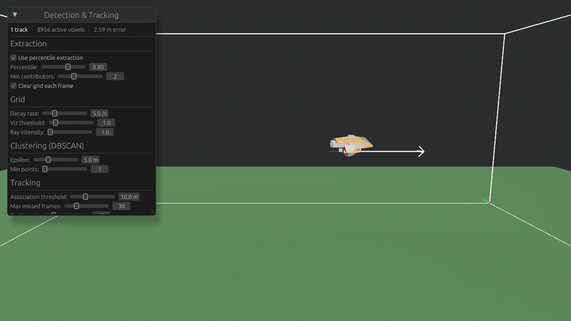

# Iluvatar

Iluvatar is a prototype real-time motion-tracking system that reconstructs motion in
3D from multiple ordinary cameras. Camera units send sparse per-pixel motion rather
than video; a central Rust server projects those observations through a voxel grid,
clusters intersections, and tracks objects over time.

The hardware path runs across both cores of a CanMV-K230:

```mermaid
flowchart LR
    sensor[OV5647 sensor] --> isp[VICAP / ISP\n1280×720 NV12]
    isp --> motion[RT-Smart big core\nOdin EMA + 2×2 max-pool]
    motion -->|DATAFIFO shared memory| forwarder[Linux little core\nC latest-frame forwarder]
    forwarder -->|framed TCP + postcard| server[Rust server\n3D-DDA raymarching]
    server --> grid[voxel decay + DBSCAN]
    grid --> tracker[Hungarian assignment\n+ Kalman tracking]
    tracker --> viewer[WebSocket viewer]
```



This repository is a curated engineering prototype, not a production surveillance
system. It preserves the working system and the evidence behind it while keeping
unfinished product work out of the public surface.



*Geometric simulation: four cameras contribute sparse rays to a shared voxel grid;
the reconstructed object is clustered and tracked with live position-error telemetry.*

## What was validated

On a CanMV-K230 with an OV5647 sensor:

- Native 720p VICAP capture reached **59–60 FPS** without automatic exposure.
- The complete camera loop—1080p sensor mode with a 1280×720 VICAP channel,
  AE/AWB, motion processing, serialization, and DATAFIFO—ran at **30 FPS**.
- The Linux forwarder sustained the 30 FPS stream with no reported drops.
- A release Rust server sustained the complete real 30 FPS stream while
  raymarching into the voxel grid.
- A controlled duplicated-input probe sustained **60.0–60.1 raymarched frames/s**
  at 69.4% of one logical core on an Intel i7-11700K. The duplication code was
  removed after the measurement.

The exact distinction matters: 60 FPS was demonstrated independently for raw capture
and server throughput; the validated end-to-end hardware pipeline runs at 30 FPS.
See [`docs/performance.md`](docs/performance.md) for methodology and limitations.

## Try the simulator

The simulator exercises projection, voxel accumulation, detection, and tracking
without K230 hardware:

```sh
cargo run --release -p iluvatar-simulator -- \
  --config config/simulator.example.toml
```

Use `--render` to replace idealized geometric cameras with rendered camera images
and GPU frame differencing.

Run the automated checks with:

```sh
cargo fmt --all -- --check
cargo clippy --workspace --all-targets -- -D warnings
cargo test --workspace --all-targets
```

## Run the server

```sh
cargo run --release -p iluvatar-server -- config/server.example.toml
```

The K230 forwarder connects over TCP on port 4434. The diagnostic viewer is served on
<http://localhost:18080>. The TCP and viewer endpoints are unauthenticated and are
intended only for an isolated development network.

## Repository map

```text
crates/iluvatar-core       Protocol, geometry, coordinate transforms, 3D-DDA
crates/iluvatar-server     Ingest, voxel grid, detection, tracking, viewer
crates/iluvatar-simulator  Reproducible multi-camera simulator
embedded/k230/camera       Odin RT-Smart capture and motion pipeline
embedded/k230/reader       C DATAFIFO-to-TCP forwarder for the Linux core
embedded/k230/runtime      RT-Smart CRT and linker support
embedded/k230/tools        Version-specific firmware image patcher
docs                       Architecture and measured performance
```

## Design notes

- **Preserve weak signals at the edge.** Isolated changed pixels can become strong
  evidence when rays from several cameras intersect, so the camera avoids destructive
  morphology and sends motion magnitude.
- **Bound stale-frame latency.** The Linux forwarder uses a single latest-frame slot
  per destination. A slow consumer loses old frames instead of increasing latency.
- **Keep the hot path sparse.** A 1280×720 luma frame becomes a bounded list of
  changed 2×2 blocks before crossing cores or the network.
- **Separate acquisition from reconstruction.** The constrained camera unit performs
  capture and differencing; the host owns spatial reconstruction and tracking.

Read [`docs/architecture.md`](docs/architecture.md) for the full data path and
[`embedded/k230/README.md`](embedded/k230/README.md) for the board build.

## Current limitations

- Only one physical camera was available for the final hardware validation. Physical
  multi-camera reconstruction is therefore unverified; it is covered by simulator
  and integration tests.
- Quiet-scene motion thresholds still need environment-specific tuning.
- The K230 image used for validation had a broken RT-Smart ShareFS client. The camera
  application was embedded into the RT firmware image as a documented workaround.
- K230 SDK libraries and firmware are not redistributed here.
- Network authentication and deployment hardening are out of scope for this prototype.

## License

Original project code is available under the [MIT License](LICENSE). The two Canaan
DATAFIFO headers retained under `embedded/k230/reader/vendor/` carry their own BSD-style
license notices.
